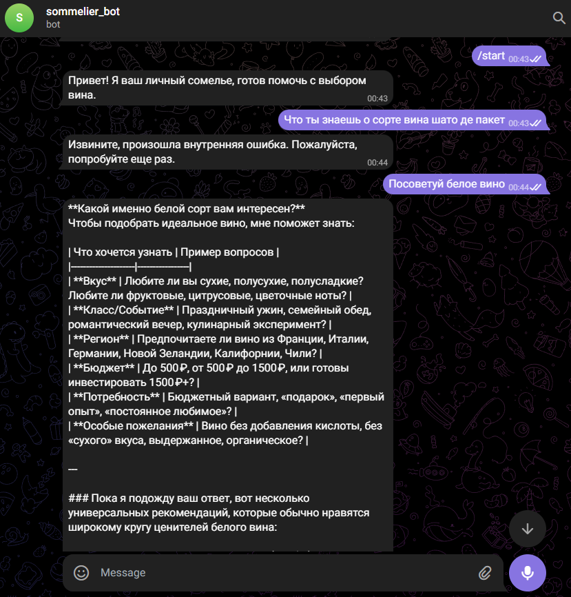

# Отчет о выполнении задания по разработке Telegram-бота

## Название проекта и краткое описание

**LLM Telegram Ассистент-Сомелье**

Проект представляет собой Telegram-бота, который взаимодействует с пользователем, выступая в роли ассистента-сомелье. Основная задача бота — вести диалог и отвечать на вопросы, связанные с вином, используя возможности Large Language Models (LLM) для генерации ответов. Проект реализован с акцентом на простоту, модульность и быструю проверку идеи (MVP).

## Выбранная роль ИИ-ассистента и её обоснование

В процессе выполнения задания я выступал в роли **Code-Ассистента**. Моя основная задача заключалась в помощи пользователю в разработке Telegram-бота, следуя предоставленному техническому видению (`vision.md`), итерационному плану (`tasklist.md`) и правилам разработки (`conventions.md`, `workflow.md`).

Обоснование выбора роли:
1.  **Пошаговая реализация:** Требовалось строгое следование итерационному плану, что подразумевало последовательное выполнение задач, предложенное мной решение, ожидание подтверждения пользователя, реализация и обновление прогресса.
2.  **Генерация кода и документации:** Я отвечал за создание файлов, написание и изменение кода Python, а также за генерацию всей проектной документации (vision, conventions, tasklist, report).
3.  **Взаимодействие и согласование:** Моя роль включала активное взаимодействие с пользователем для согласования каждого шага разработки, обсуждения предлагаемых решений и подтверждения выполнения задач.
4.  **Соблюдение принципов:** Необходимо было постоянно учитывать принципы KISS и YAGNI, а также другие правила разработки, такие как модульность и подход к конфигурированию и логгированию.

## Реализованные возможности

В рамках выполнения задания были реализованы следующие возможности:

- [x] **Инициализация бота и команда `/start`**: Создана базовая структура проекта, настроено управление зависимостями с `uv`, инициализирован Telegram-бот на `aiogram` и реализован обработчик команды `/start`.
- [x] **Базовый диалог с LLM**: Добавлена интеграция с LLM через `openai` клиент и провайдер Openrouter. Бот может принимать текстовые сообщения от пользователя и отправлять их в LLM для получения ответов.
- [x] **Контекст диалога (история)**: Реализован механизм хранения истории диалога в оперативной памяти, что позволяет LLM "помнить" предыдущие реплики пользователя и отвечать, учитывая контекст последних `N` сообщений.
- [x] **Доработка конфигурирования**: Улучшена система конфигурирования, добавлена более надежная обработка отсутствующих переменных окружения с выдачей информативных ошибок.
- [x] **Базовое логгирование**: Настроено базовое логгирование с использованием стандартной библиотеки `logging`, включающее информационные логи о работе бота и логи ошибок при сбоях в `main.py`, `handlers.py` и `llm_service.py`.

## Технологический стек

-   **Язык программирования:** Python
-   **Управление зависимостями:** `uv`
-   **Фреймворк для Telegram-бота:** `aiogram` (с использованием `polling`)
-   **Взаимодействие с LLM:** `openai` клиент
-   **Провайдер LLM:** Openrouter
-   **Автоматизация задач:** `make`
-   **Конфигурация:** Переменные окружения (`.env`)
-   **Логгирование:** Стандартная библиотека `logging`

## Инструменты AI-driven разработки

-   **Используемая AI-coding IDE:** Cursor
-   **Используемые LLM модели для генерации документации и кода:** Gemini

## Скриншот работы

## Процесс разработки: основные вызовы и решения

В процессе AI-driven разработки проекта Telegram-бота с ролью сомелье были выявлены и решены следующие основные вызовы:

1.  **Обеспечение асинхронности взаимодействия с LLM:**
    *   **Вызов:** Изначально при попытке вызова `openai` клиента с `await` возникла ошибка `TypeError: object ChatCompletion can't be used in 'await' expression`. Это указывало на то, что используемый клиент был синхронным, а ожидался асинхронный.
    *   **Решение:** Проблема была решена путем замены импорта `OpenAI` на `AsyncOpenAI` из библиотеки `openai`, что позволило корректно использовать асинхронные вызовы к LLM API.

2.  **Управление историей диалога в MVP:**
    *   **Вызов:** Для поддержания контекста диалога с LLM требовалось хранить историю сообщений. Важным было реализовать это максимально просто, без использования баз данных, согласно принципам KISS/YAGNI.
    *   **Решение:** Использован простой механизм хранения истории в оперативной памяти в виде глобального словаря `user_chat_history` в `handlers.py`, где ключом выступает ID пользователя. История очищается при команде `/start` и обрезается до `CHAT_HISTORY_LENGTH` перед отправкой в LLM.

3.  **Логгирование и отладка:**
    *   **Вызов:** Необходимость иметь базовую видимость работы бота и оперативно отлаживать возможные ошибки.
    *   **Решение:** Интегрирована стандартная библиотека `logging` в `main.py`, `handlers.py` и `llm_service.py`. Добавлены информационные логи о ключевых событиях (старт/остановка бота, получение/отправка сообщений, запросы/ответы LLM) и логи ошибок с помощью `try-except` блоков, а также общий обработчик ошибок для `aiogram` диспетчера. Это позволило быстро идентифицировать и устранять проблемы.

4.  **Соблюдение правил `workflow.md` и `conventions.md`:**
    *   **Вызов:** Постоянное следование строгому рабочему процессу, включающему предварительное согласование решений, пошаговую реализацию, обновление тасклиста и коммиты.
    *   **Решение:** Активное использование `todo_write` для отслеживания прогресса и `edit_file` для внесения изменений после согласования. Этот итерационный подход обеспечил структурированность и контролируемость процесса разработки.

## Что узнал нового в процессе AI-driven разработки

В процессе выполнения данного проекта в режиме AI-driven разработки я узнал следующее:

1.  **Важность детального планирования и документирования:** Наличие четких документов (`vision.md`, `conventions.md`, `tasklist.md`, `workflow.md`) значительно упростило процесс разработки, обеспечив единое понимание целей, архитектуры, стандартов и последовательности действий. Это помогло избежать недопониманий и ускорило итерации.
2.  **Эффективность итерационного подхода с согласованием:** Пошаговая реализация с предварительным согласованием каждого этапа и последующей проверкой оказалась очень эффективной. Это позволило быстро корректировать курс, если возникали расхождения с ожиданиями, и поддерживать высокий уровень контроля над проектом.
3.  **Автоматизация рутинных задач с помощью AI:** Использование AI-ассистента для генерации кода, создания файлов, модификации существующих частей кода, а также для обновления документации и отслеживания прогресса, значительно сократило время на рутинные операции, позволив сосредоточиться на более высокоуровневых задачах.
4.  **Обработка ошибок и логгирование как ключевые элементы стабильности:** Раннее внедрение надежной обработки ошибок и информативного логгирования позволило быстро выявлять и устранять проблемы, такие как неверное использование асинхронного клиента LLM или отсутствующие переменные окружения, что критически важно для стабильности приложения.
5.  **Гибкость LLM-интеграции:** Использование `openai` клиента с `Openrouter` продемонстрировало гибкость в интеграции с различными LLM. Это позволяет легко менять модели и провайдеров, что является важным аспектом при быстро развивающихся технологиях LLM.

## Ссылка на работающего бота

[Ссылка на Telegram-бота](https://t.me/sommelier_tas_bot)
