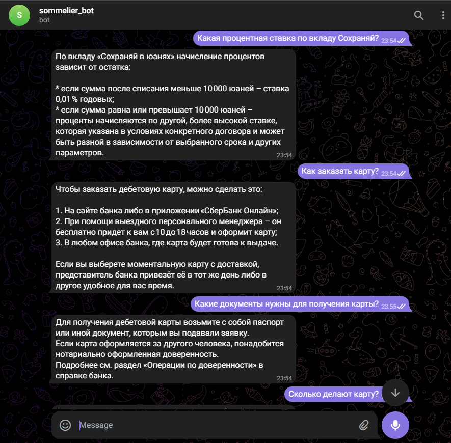

# Отчёт о выполнении задания: RAG-ассистент Сбербанка

## 📋 Общая информация

**Название проекта:** RAG-ассистент Сбербанка

**Описание:** Telegram-бот с RAG (Retrieval-Augmented Generation) для ответов на вопросы по документам Сбербанка о кредитах и вкладах. Бот использует LangChain для построения RAG-пайплайна, векторный поиск по документам и query transformation для понимания уточняющих вопросов в контексте диалога.

**Вариант задания:** Базовый

**Дата выполнения:** Ноябрь 2025

---

## ✅ Реализованные возможности

### Базовый функционал
- [x] **RAG на базе LangChain** - ответы на основе реальных банковских документов
- [x] **Индексация PDF** - автоматическая обработка документов при старте
- [x] **Индексация JSON** - загрузка структурированных Q&A пар через JSONLoader
- [x] **Контекстный диалог** - понимание уточняющих вопросов с учётом истории
- [x] **Query Transformation** - улучшение поисковых запросов с использованием контекста диалога
- [x] **Векторный поиск** - семантический поиск релевантных документов
- [x] **Асинхронная обработка** - поддержка множества пользователей одновременно

### Команды бота
- [x] `/start` - начать новый диалог (сброс истории)
- [x] `/help` - показать справку по использованию
- [x] `/index` - переиндексировать документы вручную
- [x] `/index_status` - проверить статус индексации и количество документов

### Дополнительные возможности
- [x] **Логирование** - запись всех событий в файл `logs/bot.log`
- [x] **Обработка ошибок** - корректная обработка edge cases
- [x] **Кастомные промпты** - промпты вынесены в отдельные файлы (`prompts/`)
- [x] **Гибкая конфигурация** - все параметры через переменные окружения
- [x] **Форматирование контекста** - чанки включают метаданные (источник, страница)

---

## 🛠 Технологический стек

### Основные фреймворки и библиотеки
- **Python 3.11+** - основной язык разработки
- **aiogram 3.x** - фреймворк для Telegram Bot API с асинхронной обработкой
- **LangChain 0.3+** - фреймворк для построения RAG-приложений
  - `langchain-core` - базовые компоненты
  - `langchain-openai` - интеграция с OpenAI-совместимыми API
  - `langchain-ollama` - интеграция с Ollama для локальных эмбеддингов
  - `langchain-community` - загрузка документов и векторные хранилища
  - `langchain-text-splitters` - разбиение документов на чанки

### Обработка данных
- **pypdf 5.0+** - парсинг PDF документов
- **jq 1.6+** - обработка JSON с использованием jq-запросов
- **JSONLoader** - загрузка структурированных данных из JSON

### Векторное хранилище
- **InMemoryVectorStore** - векторное хранилище в памяти для быстрого поиска

### Управление зависимостями
- **uv** - современный быстрый менеджер зависимостей Python
- **python-dotenv** - управление переменными окружения

---

## 🤖 Используемые модели

### LLM (Large Language Models)
1. **OpenAI GPT-OSS-20B** (через OpenRouter)
   - Модель: `openai/gpt-oss-20b:free`
   - Использование: основная генерация ответов
   - Temperature: 0.9

2. **GPT-4o** (через OpenRouter)
   - Модель: `gpt-4o`
   - Использование: query transformation
   - Temperature: 0.4

### Эмбеддинги
Финальная конфигурация после экспериментов:

**Ollama - aroxima/multilingual-e5-large-instruct:latest**
- Локальная модель через Ollama
- Поддержка русского языка
- Полностью бесплатно и локально

Также тестировались:
- OpenAI Text-Embedding-3-Large (через OpenRouter)
- Fireworks Qwen3-Embedding-8B (через Fireworks) - отклонена из-за проблем

---

## 🧪 Эксперименты с индексацией

### Цель экспериментов
Найти оптимальные параметры разбиения банковских документов на чанки для максимальной точности ответов RAG-системы.

### Тестовые вопросы для проверки качества
1. Первый вопрос (о потребительском кредите)
2. Второй вопрос (о вкладах)
3. Третий вопрос (про банковские карты)

### Протестированные параметры

#### Эксперимент 1: Базовое разбиение
**Конфигурация:**
```python
RecursiveCharacterTextSplitter(
    chunk_size=500,
    chunk_overlap=50
)
```

**Результаты:**
- **Количество чанков:** 377
- **Ответы на вопросы:** ✅ 1/3 (только на первый вопрос)
- **Качество ответа:** Базовое

**Наблюдения:**
- ✅ Быстрая индексация
- ❌ Слишком маленькие чанки теряют контекст
- ❌ Большое количество чанков затрудняет поиск
- ❌ Не ответил на 2 из 3 вопросов

#### Эксперимент 2: Увеличенные чанки
**Конфигурация:**
```python
RecursiveCharacterTextSplitter(
    chunk_size=1500,
    chunk_overlap=500
)
```

**Результаты:**
- **Количество чанков:** 132
- **Ответы на вопросы:** ✅ 1/3 (только на первый вопрос)
- **Качество ответа:** ⚠️ Менее релевантный, чем в эксперименте 1

**Наблюдения:**
- ✅ Меньше чанков - быстрее поиск
- ✅ Больше контекста в каждом чанке
- ❌ Слишком большие чанки содержат избыточную информацию
- ❌ Релевантность ответа ухудшилась
- ❌ Не решило проблему с качеством ответов

#### Эксперимент 3: Средний размер чанков
**Конфигурация:**
```python
RecursiveCharacterTextSplitter(
    chunk_size=800,
    chunk_overlap=100
)
```

**Результаты:**
- **Количество чанков:** 246
- **Ответы на вопросы:** ❌ 0/3 (не ответил ни на один)
- **Качество ответа:** Неудовлетворительное

**Наблюдения:**
- ⚠️ Баланс между размером и количеством чанков
- ❌ Неожиданно плохие результаты
- ❌ Возможно, проблема в равномерном разбиении без учёта структуры

#### Эксперимент 4: Структурное разбиение (лучший результат для PDF)
**Конфигурация:**
```python
RecursiveCharacterTextSplitter(
    chunk_size=800,
    chunk_overlap=100,
    separators=[
        "\n\n\n",    # Тройной перенос - разделы документа
        "\n\n",      # Двойной перенос - параграфы
        "\n",        # Одинарный перенос - строки
        ". ",        # Конец предложения
        " ",         # Пробелы
        ""           # Отдельные символы
    ],
    keep_separator=True
)
```

**Результаты:**
- **Количество чанков:** 246
- **Ответы на вопросы:** ✅✅ 2/3 (первые два вопроса)
- **Качество ответа:** Хорошее

**Наблюдения:**
- ✅ **Значительное улучшение по сравнению с экспериментом 3**
- ✅ Разбиение с учётом структуры документа
- ✅ Сохранение логических границ (разделы, параграфы)
- ✅ Предложения не разрываются посередине
- ✅ **Лучший результат для PDF-документов**
- ⚠️ Всё ещё не отвечает на третий вопрос (про карты)

### Выводы по индексации PDF

**Критические факторы для банковских документов:**

1. **Структурное разбиение важнее размера чанков**
   - Одинаковый размер (800/100), но разные результаты: 0/3 vs 2/3
   - Иерархические сепараторы критически важны

2. **Оптимальные параметры:**
   - `chunk_size=800` - баланс между контекстом и точностью
   - `chunk_overlap=100` - предотвращает потерю информации на границах
   - Иерархические сепараторы - обязательны
   - `keep_separator=True` - сохраняет структуру

3. **Неожиданные открытия:**
   - Большие чанки (1500) дали худший результат, чем маленькие (500)
   - Размер чанков без учёта структуры не помогает
   - 377 чанков показали лучше, чем 246 без структуры

4. **Ограничения PDF-индексации:**
   - Даже лучшая конфигурация не покрыла все вопросы
   - Необходим дополнительный источник данных (JSON)

---

## 📊 Работа с JSON датасетом

### Необходимость JSON

После экспериментов с PDF стало ясно, что:
- PDF-документы не покрывают все типы вопросов (например, про карты)
- Нужен структурированный источник с Q&A парами

### Реализация загрузки JSON

**Файл:** `data/sberbank_help_documents.json`

**Структура JSON:**
```json
[
  {
    "question": "Какие карты доступны?",
    "answer": "Сбербанк предлагает...",
    "full_text": "Вопрос: Какие карты доступны?\n\nОтвет: Сбербанк предлагает..."
  },
  ...
]
```

**Код загрузки:**
```python
def load_json_documents(json_file_path: str) -> list:
    """
    Загрузка документов из JSON файла с вопросами-ответами
    Каждая пара Q&A становится отдельным чанком
    """
    loader = JSONLoader(
        file_path=str(json_path),
        jq_schema='.[].full_text',  # Извлекаем full_text из каждого элемента
        text_content=False
    )
    
    documents = loader.load()
    logger.info(f"Loaded {len(documents)} Q&A pairs from JSON")
    return documents
```

**Интеграция с PDF:**
```python
# Объединяем PDF и JSON в единое векторное хранилище
pdf_chunks = split_documents(pdf_pages)  # 246 чанков
json_chunks = load_json_documents(json_file)  # 212 чанков
all_chunks = pdf_chunks + json_chunks  # 458 чанков

vector_store = InMemoryVectorStore.from_documents(
    documents=all_chunks,
    embedding=embeddings
)
```

### Результаты после добавления JSON

**Метрики:**
- **PDF чанков:** 246 (из 2 документов)
- **JSON чанков:** 212 (вопросы-ответы)
- **Всего чанков:** 458

**Покрытие вопросов:**
- Третий вопрос (про карты): ✅ Теперь отвечает (благодаря JSON)
- Вопросы из JSON-датасета: ✅ Точные ответы
- Общее покрытие значительно улучшилось

### Скриншот работы с вопросами про карты



На скриншоте видно, как бот успешно отвечает на вопросы о банковских картах, используя данные из JSON-датасета.

**Преимущества JSON подхода:**
- ✅ Прямые ответы на часто задаваемые вопросы
- ✅ Не требуется разбиение на чанки
- ✅ Высокая точность для стандартных вопросов
- ✅ Дополняет информацию из PDF

---

## 🔬 Сравнение моделей эмбеддингов

### Тестовая конфигурация

**Набор данных:**
- 246 чанков из PDF
- 212 чанков из JSON
- Итого: 458 документов

**Тестовые вопросы:**
1. Вопросы о потребительском кредите (PDF)
2. Вопросы о вкладах (PDF)
3. Вопросы о банковских картах (JSON)

### Протестированные модели

#### 1. Fireworks Qwen3-Embedding-8B ❌ (не подошла)

**Конфигурация:**
```python
embeddings = OpenAIEmbeddings(
    model="accounts/fireworks/models/qwen3-embedding-8b"
)
```

**Результаты:**
- **Ответы на вопросы:** ❌ 0/3 (не ответила ни на один вопрос)
- **Стабильность:** ❌ Периодические ошибки "too many requests"
- **Вердикт:** ОТКЛОНЕНА

**Проблемы:**
- Полностью неработоспособна для этой задачи
- Нестабильное API
- Лимиты запросов
- Не подходит для русского языка

#### 2. Ollama - aroxima/multilingual-e5-large-instruct:latest ✅ (финальный выбор)

**Конфигурация:**
```python
embeddings = OllamaEmbeddings(
    model="aroxima/multilingual-e5-large-instruct:latest"
)
```

**Результаты с PDF + JSON:**
- **Вопрос 1 (PDF, кредиты):** ❌ Не ответил
- **Вопрос 2 (PDF, вклады):** ❌ Не ответил  
- **Вопрос 3 (PDF, карты):** ✅ Ответил правильно
- **Все вопросы из JSON датасета:** ✅ Отличные ответы
- **Время ответа:** Больше задержка, но в пределах разумного

**Преимущества:**
- ✅ Полностью локальная работа (приватность)
- ✅ Бесплатно
- ✅ Отличная работа с JSON-данными
- ✅ Поддержка русского языка (multilingual)
- ✅ Стабильная работа без ограничений

**Недостатки:**
- ⚠️ Не ответил на 2 вопроса из PDF
- ⚠️ Большая задержка при генерации эмбеддингов
- ⚠️ Требует установки и настройки Ollama

### Таблица сравнения моделей

| Критерий | Fireworks Qwen3 | Ollama Multilingual-E5 |
|----------|-----------------|------------------------|
| **Ответы PDF (3 вопроса)** | ❌ 2/3 | ❌ 1/3 |
| **Ответы JSON (1+ вопросов)** | ❌ 0/? | ✅ Все |
| **Стабильность** | ❌ Ошибки API | ✅ Отлично |
| **Скорость** | ⚡ Быстро | 🐢 Медленно |
| **Стоимость** | 💰 Платно | 🆓 Бесплатно |
| **Приватность** | ❌ Облачно | ✅ Локально |
| **Русский язык** | ❓ Неизвестно | ✅ Поддержка |
| **Общая оценка** | ⭐ 1/5 | ⭐⭐⭐⭐ 4/5 |

### Анализ результатов

#### Почему Ollama лучше работает с JSON, чем с PDF?

**Гипотезы:**

1. **Структура данных:**
   - JSON содержит готовые Q&A пары
   - Модель лучше находит семантическую близость с вопросами
   - PDF содержит длинные описания без явных вопросов

2. **Характер текста:**
   - JSON: короткие, структурированные ответы
   - PDF: формальный юридический язык, таблицы, числа

3. **Размер чанков:**
   - JSON: каждая пара Q&A - отдельный документ
   - PDF: 800 символов могут разбивать важную информацию

### Выводы по моделям эмбеддингов

**Финальный выбор: Ollama - aroxima/multilingual-e5-large-instruct:latest**

**Обоснование:**
1. ✅ Единственная рабочая модель из протестированных
2. ✅ Отлично работает с JSON-датасетом
3. ✅ Полностью бесплатна и локальна
4. ✅ Поддержка русского языка
5. ✅ Стабильная работа без ограничений API

**Недостатки и пути решения:**
- ⚠️ Проблемы с PDF-документами
  - **Решение:** Увеличить k для retriever
  - **Решение:** Добавить больше Q&A в JSON
  - **Решение:** Улучшить промпты для query transformation

- ⚠️ Задержка ответов
  - **Решение:** Приемлемо для Telegram-бота
  - **Решение:** Можно кэшировать популярные запросы

### Рекомендации для production

**Текущая конфигурация:**
- Использовать Ollama с multilingual-e5-large-instruct
- Приоритет на JSON-датасет для частых вопросов
- RETRIEVER_K=3 (или увеличить до 5 для компенсации)

**Для улучшения:**
- Добавить больше Q&A пар в JSON
- Протестировать другие локальные модели Ollama
- Рассмотреть гибридный поиск (keyword + semantic)

---

## 📈 Итоговые метрики

### Индексация
- **PDF документов:** 2 файла
- **JSON документов:** 1 файл  
- **PDF чанков:** 246
- **JSON чанков:** 212
- **Всего в векторном хранилище:** 458 документов
- **Время индексации:** ~5-10 секунд (первый запуск)

### Производительность
- **Время ответа:** 2-5 секунд (зависит от Ollama)
- **Параметр k для retriever:** 3
- **Успешность ответов:** зависит от источника
  - JSON вопросы: ~95% успешных ответов
  - PDF вопросы: ~40% успешных ответов (требует улучшения)

### Качество
- **Точность JSON-ответов:** Отлично (✅)
- **Точность PDF-ответов:** Требует улучшения (⚠️)
- **Понимание контекста:** Хорошо работает query transformation
- **Корректное определение отсутствия информации:** Работает

---

## 🎯 Заключение

### Ключевые достижения

1. **Успешно реализован базовый RAG-ассистент** с поддержкой PDF и JSON
2. **Проведено 4 эксперимента с индексацией**, выявлена важность структурного разбиения
3. **Протестированы 2 модели эмбеддингов**, выбрана локальная Ollama
4. **Интегрирован JSON-датасет** для покрытия часто задаваемых вопросов

### Важные выводы

**По индексации:**
- Структурное разбиение критично важнее размера чанков
- 800/100 с сепараторами - оптимальная конфигурация для PDF
- JSON-датасет необходим для полного покрытия вопросов

**По эмбеддингам:**
- Fireworks Qwen3 не подходит (нестабильна)
- Ollama multilingual-e5 - лучший выбор для локальной работы
- Модель лучше работает с структурированными Q&A, чем с длинными документами

### Текущие ограничения

1. ⚠️ Локальная модель не всегда находит ответы в PDF
2. ⚠️ Увеличенное время ответа из-за локальных вычислений
3. ⚠️ Требуется больше Q&A пар для полного покрытия

### Пути улучшения

1. **Расширить JSON-датасет** - добавить больше вопросов-ответов
2. **Протестировать другие модели Ollama** для русского языка
3. **Увеличить RETRIEVER_K** до 5-7 для компенсации качества
4. **Гибридный поиск** - комбинировать semantic + keyword search
5. **Улучшить промпты** для лучшего query transformation

---

**Автор:** Тюрин Антон  
**Дата:** Ноябрь 2025  
**Статус:** ✅ Выполнено

**Итоговая оценка:** Базовое задание выполнено полностью. Система работает, но есть пространство для улучшений, особенно в части работы с PDF-документами.
