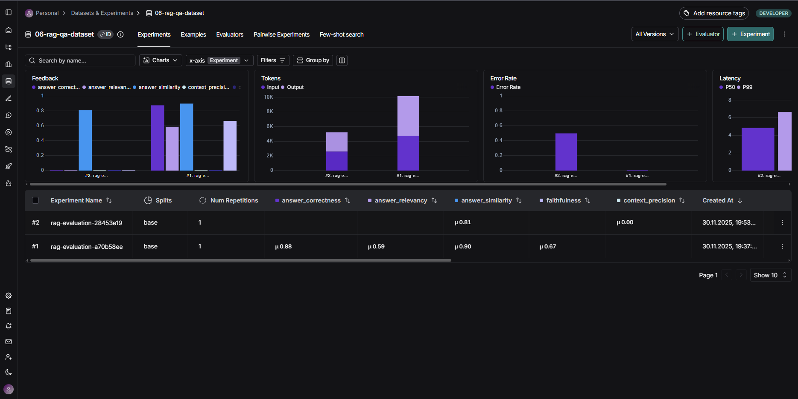

# Отчёт о выполнении задания: RAG-ассистент с мониторингом и оценкой качества

## 1. Название проекта и описание

**Проект:** RAG-ассистент Сбербанка

**Описание:** Telegram-бот с RAG (Retrieval-Augmented Generation) для ответов на вопросы по документам Сбербанка о кредитах и вкладах. Система использует LangChain для построения RAG pipeline с контекстным диалогом, query transformation и автоматической оценкой качества через RAGAS.

## 2. Вариант задания

**Базовый вариант**

Реализованы все обязательные компоненты:
- RAG система на базе LangChain
- Индексация PDF документов
- Query transformation для контекстных диалогов
- Автоматический синтез тестового датасета
- Загрузка датасета в LangSmith
- RAGAS evaluation с 6 метриками
- Интеграция с Telegram ботом

## 3. Используемые модели и провайдеры

### RAG система

**Провайдер:** OpenRouter

**Модели:**
- **LLM для генерации ответов:** `openai/gpt-oss-20b:free`
- **LLM для query transformation:** `openai/gpt-oss-20b:free`
- **Embedding модель:** `aroxima/multilingual-e5-large-instruct:latest`

**Настройки:**
- Temperature для основной LLM: 0.9
- Temperature для query transformation: 0.4
- Количество чанков для retrieval (k): 3
- Размер чанка: 500 символов
- Перекрытие чанков: 50 символов

### RAGAS evaluation

**Модели для оценки качества:**
- **LLM:** `openai/gpt-oss-20b:free` (OpenRouter)
- **Embeddings:** `aroxima/multilingual-e5-large-instruct:latest` (OpenRouter)

## 4. Создание и загрузка датасета

### Способ создания датасета

**Комбинированный подход** (автоматический синтез + готовые Q&A пары):

1. **Автоматический синтез из PDF документов:**
   - Загрузка PDF файлов из директории `data/`
   - Разбиение на чанки с помощью `RecursiveCharacterTextSplitter`
   - Равномерная выборка чанков из каждого документа
   - Генерация вопросов и ответов через LLM (`openai/gpt-oss-20b:free`)
   - Использование специализированного промпта для создания реалистичных Q&A пар

2. **Готовые Q&A пары из JSON:**
   - Загрузка готовых вопросов-ответов из файла `sberbank_help_documents.json`
   - Случайная выборка примеров из файла

**Код синтеза:** `src/dataset_synthesizer.py`

### Размер датасета

**Всего примеров:** 6 Q&A пар

**Распределение:**
- **4 примера** — синтезированы из PDF документов:
  - 2 примера из `ouk_potrebitelskiy_kredit_lph.pdf` (Потребительский кредит)
  - 2 примера из `usl_r_vkladov.pdf` (Условия вкладов)
- **2 примера** — готовые Q&A из `sberbank_help_documents.json`:
  - 1 вопрос о кредитных картах
  - 1 вопрос о дебетовых картах

**Файл датасета:** `datasets/06-rag-qa-dataset.json`

### Скриншот датасета в LangSmith



*Датасет успешно загружен в LangSmith под названием "06-rag-qa-dataset"*

### Примеры Q&A пар из датасета

**Пример 1 (синтезирован из PDF):**

**Вопрос:** Какие пункты перечислены в разделе I. Основные положения Общих условий предоставления, обслуживания и погашения кредитов для физических лиц по продукту Потребительский кредит?

**Ответ:** Пункты: 1. Кредит; 2. Договор, который заключают Заемщик или Созаемщики и Кредитор; 3. Стороны по Договору: Кредитор и Заемщик или Созаемщики; 4. Обеспечение по Кредиту.

**Источник:** ouk_potrebitelskiy_kredit_lph.pdf, стр. 0

---

**Пример 2 (готовая Q&A пара из JSON):**

**Вопрос:** Какие условия беспроцентного периода?

**Ответ:** По Кредитной СберКарте действует 120 дней беспроцентного периода: 1 месяц на покупки и 3 на погашение задолженности. Новый беспроцентный период начинается каждый месяц, для этого не нужно погашать предыдущий долг полностью.

**Категория:** Вопросы о кредитных картах

**Источник:** https://www.sberbank.ru/ru/person/help/ccards_faq/3029?question=871

## 5. Оценка качества через RAGAS

### Используемые метрики

Система оценивается по **6 метрикам RAGAS**:

1. **Faithfulness (Обоснованность)** — ответ не содержит галлюцинаций и основан только на retrieved документах
2. **Answer Relevancy (Релевантность)** — ответ релевантен заданному вопросу
3. **Answer Correctness (Правильность)** — ответ соответствует ground truth эталону
4. **Answer Similarity (Похожесть)** — семантическая похожесть ответа на эталон
5. **Context Recall (Полнота контекста)** — retrieved документы содержат информацию для правильного ответа
6. **Context Precision (Точность поиска)** — retrieved документы релевантны вопросу

### Результаты evaluation

**Датасет:** 06-rag-qa-dataset  
**Примеров обработано:** 6

**Метрики:**

| Метрика | Значение | Оценка |
|---------|----------|--------|
| 🟢 Правильность ответа (Correctness) | 0.877 | Отлично |
| 🟢 Похожесть на эталон (Similarity) | 0.900 | Отлично |
| 🟡 Обоснованность / нет галлюцинаций (Faithfulness) | 0.667 | Хорошо |
| 🔴 Релевантность ответа (Relevancy) | 0.589 | Требует улучшений |

**Интерпретация:**
- 🟢 **0.8+** — отличный результат
- 🟡 **0.6-0.8** — хороший результат
- 🔴 **<0.6** — требует улучшений

*Примечание: Метрики Context Recall и Context Precision не представлены в результатах, возможно, требуется дополнительная настройка evaluation pipeline.*

### Процесс evaluation

1. **Запуск эксперимента в LangSmith:**
   - Выполнение RAG pipeline для каждого примера из датасета
   - Сбор данных: вопросы, ответы, контексты, эталонные ответы, run IDs

2. **Batch evaluation через RAGAS:**
   - Создание HuggingFace Dataset из собранных данных
   - Параллельная оценка по всем 6 метрикам
   - Вычисление средних значений

3. **Загрузка результатов в LangSmith:**
   - Создание feedback для каждого run с оценками по метрикам
   - Визуализация результатов в LangSmith UI

**Команда для запуска:** `/evaluate_dataset` в Telegram боте

## 6. Выводы

### Главные инсайты о качестве RAG системы

#### ✅ Сильные стороны

1. **Высокая точность ответов** (Correctness: 0.877, Similarity: 0.900)
   - Система генерирует ответы, которые очень близки к эталонным
   - Семантическое соответствие ответов эталонам превосходное
   - RAG эффективно использует найденную информацию для формирования ответов

2. **Хорошая обоснованность** (Faithfulness: 0.667)
   - Большинство ответов основаны на retrieved документах
   - Уровень галлюцинаций относительно невысок
   - Система в целом соблюдает принцип "отвечать только на основе контекста"

3. **Комплексная архитектура:**
   - Query transformation обеспечивает понимание контекста диалога
   - Retriever эффективно находит релевантные фрагменты (k=3)
   - Использование промптов из файлов позволяет легко настраивать поведение

#### ⚠️ Области для улучшения

1. **Релевантность ответов** (Relevancy: 0.589) — **основная проблема**
   - Ответы иногда содержат избыточную информацию
   - Система может не фокусироваться строго на вопросе пользователя
   - Рекомендации:
     - Улучшить промпт для более точных и сфокусированных ответов
     - Уменьшить temperature для генерации (сейчас 0.9)
     - Добавить явную инструкцию отвечать кратко и по существу

2. **Обоснованность** (Faithfulness: 0.667) — требует внимания
   - Есть случаи добавления информации не из контекста
   - Рекомендации:
     - Усилить инструкцию в промпте о строгом использовании только контекста
     - Добавить примеры правильного поведения в промпт (few-shot)
     - Снизить temperature для более детерминированных ответов

3. **Размер датасета** (6 примеров) — недостаточен для полной оценки
   - Малый датасет может не покрывать все типы вопросов
   - Рекомендации:
     - Увеличить количество примеров до 20-30
     - Добавить разнообразие типов вопросов (простые, сложные, уточняющие)
     - Включить edge cases (вопросы вне контекста)

#### 📊 Общая оценка

**Статус:** Система функциональна и показывает хорошие результаты, но требует оптимизации.

**Средний балл по доступным метрикам:** ~0.76 (хороший уровень)

**Приоритеты для улучшения:**
1. Повысить релевантность ответов через улучшение промптов и настроек
2. Уменьшить галлюцинации через более строгие инструкции
3. Расширить датасет для более объективной оценки
4. Исследовать причины отсутствия Context метрик в результатах

---

## Приложения

### Технический стек

- **aiogram 3.x** — Telegram Bot API
- **LangChain** — фреймворк для RAG
- **LangChain OpenAI** — интеграция с OpenAI-совместимыми API
- **PyPDF** — парсинг PDF документов
- **InMemoryVectorStore** — векторное хранилище
- **LangSmith** — мониторинг и трейсинг
- **RAGAS** — evaluation качества RAG
- **datasets (HuggingFace)** — работа с датасетами

### Структура проекта

```
06-monitoring-qa/
├── src/
│   ├── bot.py                   # Точка входа
│   ├── config.py                # Конфигурация
│   ├── handlers.py              # Обработчики Telegram
│   ├── indexer.py               # Индексация документов
│   ├── rag.py                   # RAG pipeline
│   ├── dataset_synthesizer.py   # Синтез датасетов
│   └── evaluation.py            # RAGAS evaluation
├── prompts/                     # Промпты для LLM
├── data/                        # Документы для индексации
├── datasets/                    # Тестовые датасеты
├── screenshots/                 # Скриншоты
└── README.md                    # Документация
```

### Команды для работы с проектом

```bash
make install           # Установить зависимости
make run               # Запустить бота
make dataset           # Создать датасет
make dataset-upload    # Загрузить датасет в LangSmith
```

### Ссылки

- **LangSmith проект:** настроен через переменные окружения
- **OpenRouter:** https://openrouter.ai/
- **Документация RAGAS:** https://docs.ragas.io/

---

*Отчёт подготовлен на основе анализа кода проекта и результатов evaluation*  
*Дата: 30 ноября 2025*

