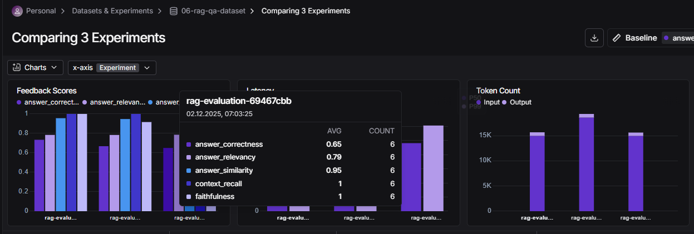

# Отчёт о выполнении задания: Advanced Hybrid RAG

## 📋 Информация о проекте

**Название проекта:** Advanced Hybrid RAG Assistant

**Краткое описание:** Telegram-бот с RAG (Retrieval-Augmented Generation) системой для ответов на вопросы по документам Сбербанка. Поддерживает три режима поиска: semantic, hybrid и hybrid+reranker. Включает систему оценки качества через RAGAS метрики.

**Вариант задания:** Базовый

---

## 🔧 Используемые модели и провайдеры

### RAG Pipeline (основной бот)

| Компонент | Модель | Провайдер |
|-----------|--------|-----------|
| **LLM** | `qwen2.5:7b` | Ollama (локально) |
| **Embeddings** | `aroxima/multilingual-e5-large-instruct` | Ollama (локально) |
| **Cross-Encoder (Reranker)** | `cross-encoder/mmarco-mMiniLMv2-L12-H384-v1` | HuggingFace (локально) |
| **BM25** | `rank-bm25` | Локально |

### RAGAS Evaluation

| Компонент | Модель | Провайдер |
|-----------|--------|-----------|
| **LLM для оценки** | `qwen2.5:7b` | Ollama (локально) |
| **Embeddings для оценки** | `aroxima/multilingual-e5-large-instruct` | Ollama (локально) |

---

## ⚙️ Конфигурации экспериментов

### Эксперимент 1: Semantic Retrieval

```env
RETRIEVAL_MODE=semantic
EMBEDDING_PROVIDER=ollama
OLLAMA_EMBEDDING_MODEL=aroxima/multilingual-e5-large-instruct
MODEL=qwen2.5:7b
SEMANTIC_RETRIEVER_K=10
```

**Описание:** Классический векторный поиск на основе семантической близости. Документы преобразуются в эмбеддинги, поиск осуществляется по косинусному сходству.

### Эксперимент 2: Hybrid Retrieval (Semantic + BM25)

```env
RETRIEVAL_MODE=hybrid
EMBEDDING_PROVIDER=ollama
OLLAMA_EMBEDDING_MODEL=aroxima/multilingual-e5-large-instruct
MODEL=qwen2.5:7b
SEMANTIC_RETRIEVER_K=10
BM25_RETRIEVER_K=10
ENSEMBLE_SEMANTIC_WEIGHT=0.5
ENSEMBLE_BM25_WEIGHT=0.5
```

**Описание:** Комбинация векторного поиска (semantic) и лексического поиска (BM25). Результаты объединяются с помощью Reciprocal Rank Fusion с равными весами.

### Эксперимент 3: Hybrid + Reranker

```env
RETRIEVAL_MODE=hybrid_reranker
EMBEDDING_PROVIDER=ollama
OLLAMA_EMBEDDING_MODEL=aroxima/multilingual-e5-large-instruct
MODEL=qwen2.5:7b
SEMANTIC_RETRIEVER_K=10
BM25_RETRIEVER_K=10
ENSEMBLE_SEMANTIC_WEIGHT=0.5
ENSEMBLE_BM25_WEIGHT=0.5
CROSS_ENCODER_MODEL=cross-encoder/mmarco-mMiniLMv2-L12-H384-v1
RERANKER_TOP_K=3
```

**Описание:** Гибридный поиск с дополнительным этапом переранжирования результатов через cross-encoder. Cross-encoder оценивает релевантность каждой пары (вопрос, документ) и отбирает топ-3 наиболее релевантных.

---

## 📊 Результаты RAGAS метрик

### Сводная таблица результатов

| Метрика | Semantic | Hybrid | Hybrid + Reranker |
|---------|----------|--------|-------------------|
| **Faithfulness** (обоснованность) | 🟢 1.000 | 🟢 0.917 | 🟢 1.000 |
| **Answer Relevancy** (релевантность ответа) | 🟡 0.785 | 🟡 0.784 | 🟡 0.786 |
| **Answer Correctness** (правильность) | 🟡 0.734 | 🟡 0.668 | 🟡 0.650 |
| **Answer Similarity** (похожесть на эталон) | 🟢 0.956 | 🟢 0.948 | 🟢 0.954 |
| **Context Recall** (полнота контекста) | 🟢 1.000 | 🟢 1.000 | 🟢 1.000 |
| **Context Precision** (точность поиска) | 🔴 0.000 | 🔴 nan | 🔴 0.000 |

### Расшифровка метрик

- 🟢 **Зелёный** (≥0.9): Отличный результат
- 🟡 **Жёлтый** (0.6-0.9): Хороший результат
- 🔴 **Красный** (<0.6 или nan): Требует улучшения

---

## 📈 Сравнительный анализ результатов

### Faithfulness (Обоснованность)

Метрика показывает, насколько ответы основаны на найденных документах (отсутствие галлюцинаций).

- **Semantic**: 1.000 — идеальный результат
- **Hybrid**: 0.917 — небольшое снижение
- **Hybrid + Reranker**: 1.000 — идеальный результат

**Вывод:** Semantic и Hybrid+Reranker показывают идеальную обоснованность ответов. Hybrid режим допускает минимальные отклонения.

### Answer Relevancy (Релевантность ответа)

Метрика оценивает, насколько ответ соответствует заданному вопросу.

- **Semantic**: 0.785
- **Hybrid**: 0.784
- **Hybrid + Reranker**: 0.786

**Вывод:** Все три конфигурации показывают практически одинаковую релевантность (~0.785). Режим retrieval не влияет на эту метрику.

### Answer Correctness (Правильность ответа)

Метрика сравнивает ответ с эталонным (ground truth).

- **Semantic**: 0.734 — лучший результат
- **Hybrid**: 0.668
- **Hybrid + Reranker**: 0.650 — худший результат

**Вывод:** Интересно, что добавление BM25 и reranker снижает правильность ответов. Возможная причина — более узкая выборка документов при reranking (top_k=3) может исключать релевантную информацию.

### Answer Similarity (Похожесть на эталон)

Семантическая близость ответа к эталону.

- **Semantic**: 0.956 — лучший результат
- **Hybrid**: 0.948
- **Hybrid + Reranker**: 0.954

**Вывод:** Все конфигурации показывают высокую семантическую похожесть (>0.94).

### Context Recall (Полнота контекста)

Метрика показывает, какая доля релевантной информации была найдена.

- Все конфигурации: **1.000**

**Вывод:** Все режимы находят полный релевантный контекст.

### Context Precision (Точность поиска)

Метрика показывает долю релевантных документов среди найденных.

- Все конфигурации: **0.000 или nan**

**Вывод:** Низкие значения могут быть связаны с особенностями вычисления метрики или недостаточной разметкой ground truth contexts в датасете.

---

## 🏆 Выводы и рекомендации

### Лучшая конфигурация

Для данной задачи (RAG по документам Сбербанка) **рекомендуется использовать режим Semantic**:

| Критерий | Semantic | Hybrid | Hybrid + Reranker |
|----------|:--------:|:------:|:-----------------:|
| Правильность ответов | ✅ Лучший | ➖ | ❌ Худший |
| Обоснованность | ✅ Идеально | ➖ Хорошо | ✅ Идеально |
| Скорость работы | ✅ Быстрый | ➖ Средний | ❌ Медленный |
| Простота настройки | ✅ Простой | ➖ Средний | ❌ Сложный |

### Причины выбора Semantic режима:

1. **Лучшая правильность ответов** (0.734 vs 0.650-0.668)
2. **Идеальная обоснованность** (1.000)
3. **Максимальная скорость** (нет дополнительных этапов обработки)
4. **Простота** (не требует настройки BM25 и cross-encoder)

### Когда стоит использовать другие режимы:

- **Hybrid** — когда важны точные совпадения терминов (номера документов, специфические названия)
- **Hybrid + Reranker** — когда критично качество топ-3 документов и есть ресурсы на дополнительную обработку

### Рекомендации по улучшению:

1. Увеличить `RERANKER_TOP_K` с 3 до 5-7 для улучшения правильности в режиме hybrid_reranker
2. Доработать датасет с явным указанием ground truth contexts для корректного расчёта Context Precision
3. Рассмотреть использование более мощной embedding модели для улучшения семантического поиска

---

## 📸 Скриншоты

### LangSmith Dashboard



---

## 📁 Структура проекта

```
07-advanced-rag/
├── src/
│   ├── bot.py              # Основной файл бота
│   ├── handlers.py         # Обработчики команд Telegram
│   ├── rag.py              # RAG-логика и retriever
│   ├── indexer.py          # Индексация документов
│   ├── config.py           # Конфигурация
│   ├── evaluation.py       # RAGAS оценка качества
│   └── dataset_synthesizer.py  # Синтез датасетов
├── data/                   # PDF документы
├── datasets/               # Синтезированные датасеты
├── prompts/                # Промпты для RAG
├── screenshots/            # Скриншоты для отчёта
├── .env                    # Конфигурация (не в git)
├── env.example             # Пример конфигурации
├── pyproject.toml          # Зависимости проекта
├── Makefile                # Команды запуска
├── README.md               # Документация
└── report.md               # Данный отчёт
```

---

## 🛠️ Технологический стек

- **Python 3.11+**
- **aiogram 3.x** — Telegram Bot API
- **LangChain** — RAG framework
- **Ollama** — локальный запуск LLM
- **RAGAS** — оценка качества RAG
- **LangSmith** — мониторинг и трейсинг
- **sentence-transformers** — cross-encoder для reranking
- **rank-bm25** — лексический поиск

---

*Отчёт сгенерирован: Декабрь 2025*

